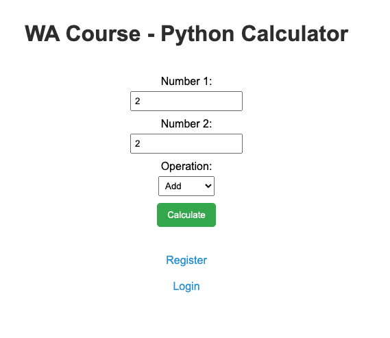
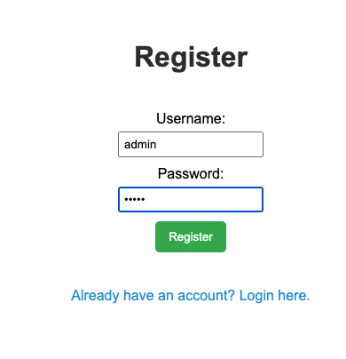
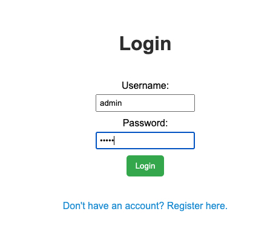
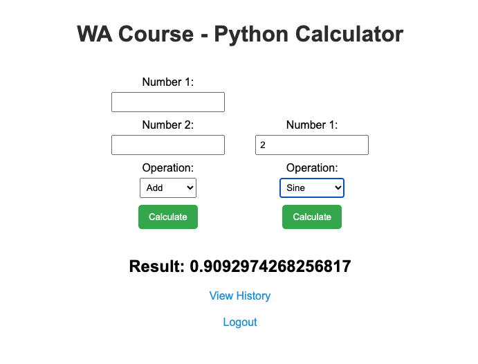
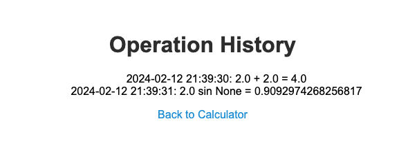

# WA Calc App - Flask Python App

## Agenda

The goal of this Flask Python app is to create a calculator with the following features:

1. **Registration and Authentication:**
   - Users can register and log in, and their data will be stored in a JSON file.
   - User data is stored in JSON format.

2. **Calculator Functionality for Unauthorized Users:**
   - For unauthorized users, the calculator provides four basic functions: addition (+), subtraction (-), multiplication (*), and division (/).

3. **Additional Functions for Authorized Users:**
   - Authorized users have access to additional functions: sine, cosine, tangent, and cotangent.

4. **Operation History:**
   - Authorized users can view the history of their operations for the last day or all history.
   - Operation history is stored in JSON format with the following fields:
     - `id` (unique number)
     - `date` (date of the operation)
     - `operation` (the mathematical operation)
     - `result` (the result of the operation)
     - `user_id` (user ID, retrieved from the `users.json` file)

5. **Example Operation Entry:**
   ```json
   [{
       "id": 1,
       "date": "20-10-1953",
       "operation": "2+2=4",
       "result": 4,
       "user_id": <user_id>
   }]
## Screenshots

### Root Route


### Register Route


### Login Route


### Registered User Route


### History Route
